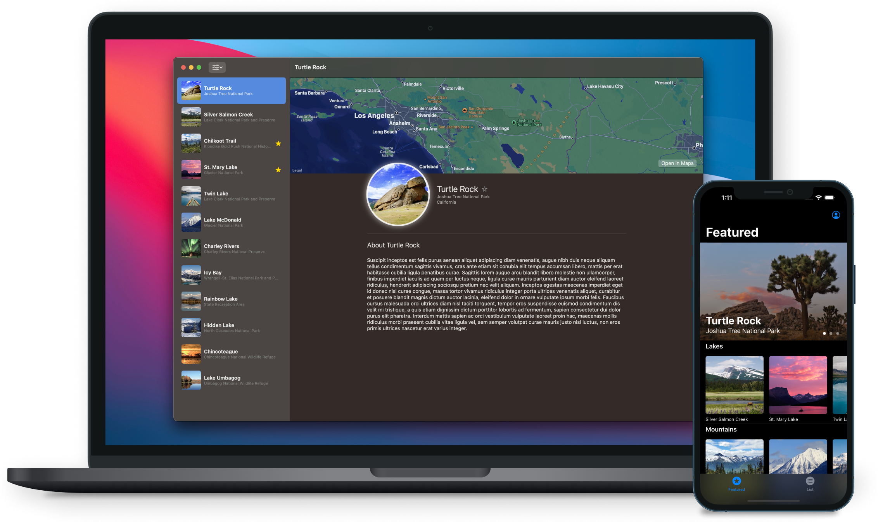
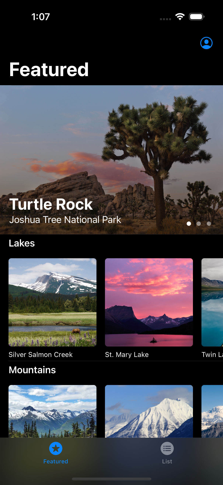
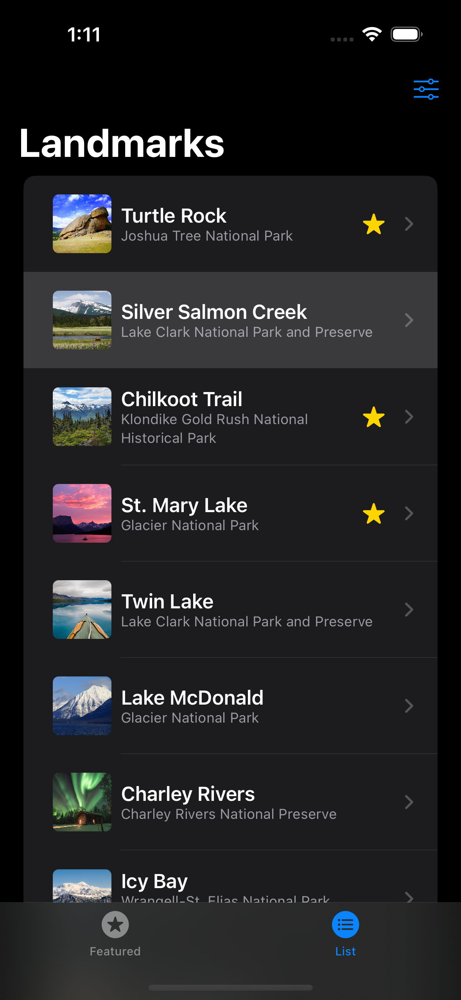
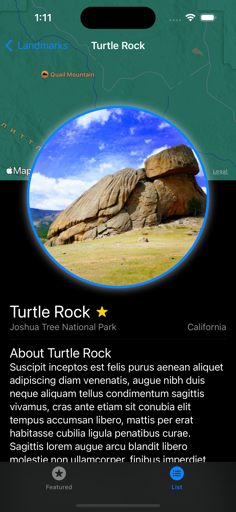
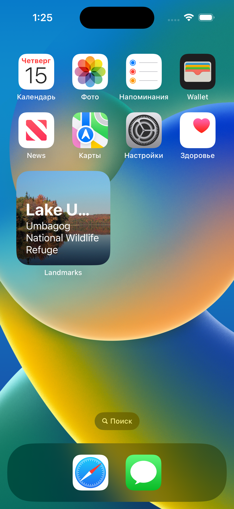
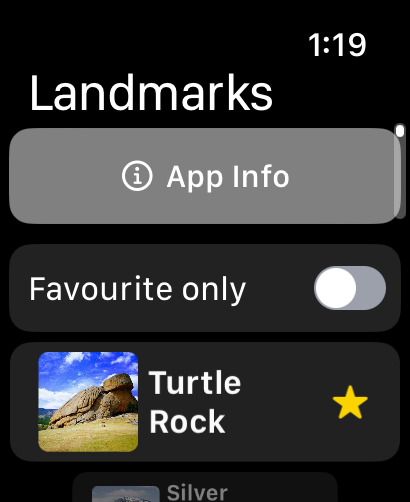
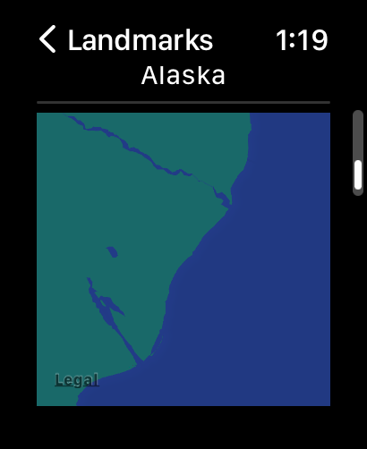
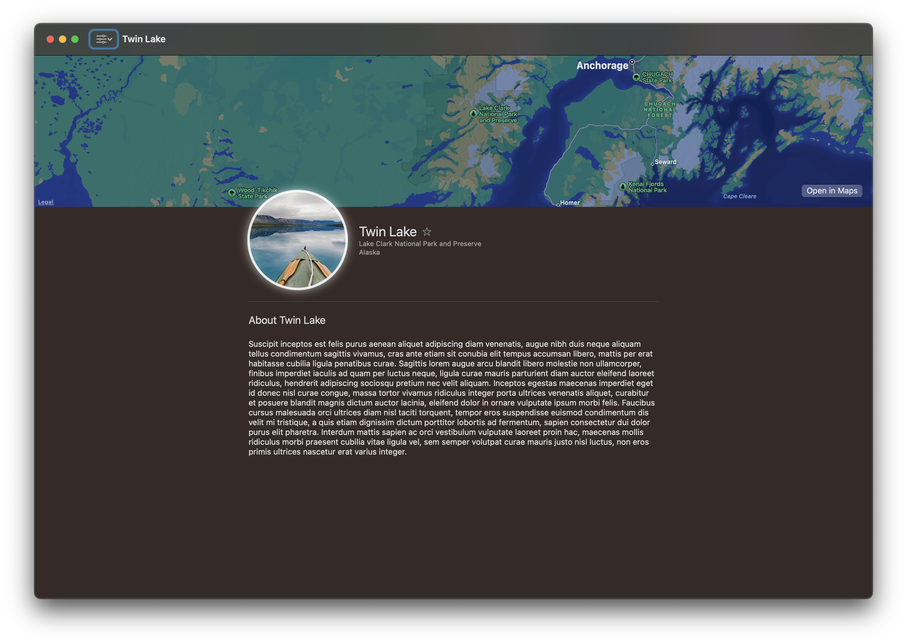

# Landmarks App

## iPhone Preview

    
    
    
    
    

## Widget Today Preview

    
    

### Feature
 * Customization widget through `Intents`

## Apple Watch Preview

    
    
    
    

### Features
 * Custom `NotificationView` for notifications

## MacOS Preview

    
    

### Feature
 * Impliment custom commands
 * Impliment custom setting view

## Technical Features

* SwiftUI
* Swift 5.7
* UIKit to SwiftUI thought `UIHostingController`
* Load data from server and save it in `UserDefault`
* Use `CoreGraphics` to draw 2D figures
* Use `MapKit` for dispaly map
* Use `SwiftUI` unified layout thought iPhone, Watch, MacOS targets